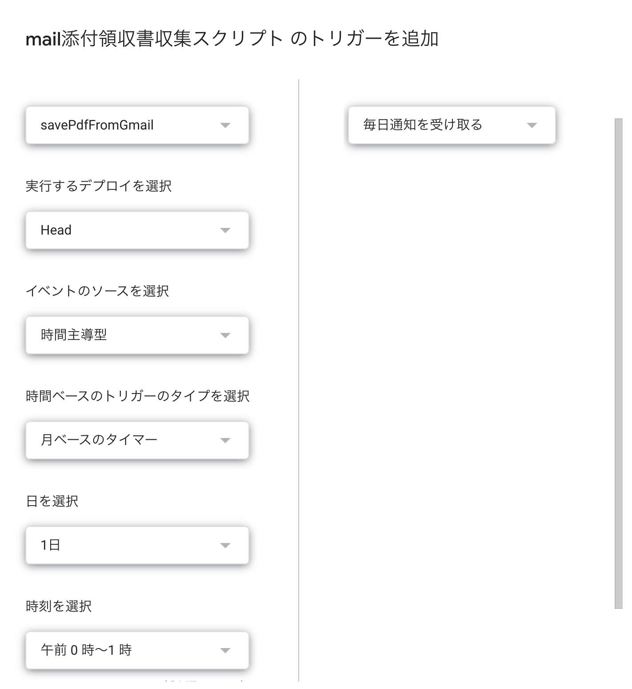

# Gmail PDF抽出スクリプト

Google Apps Scriptを使用して、Gmailの特定のメールからPDFを自動でGoogle Driveに保存するツールです。

## 機能

- スプレッドシートで管理
- 2つの保存モード:
  - 添付PDFファイルの保存
  - メール本文のPDF化
- 月指定での処理: 特定の月に受信したメールのみを対象
- ログ記録: 処理結果を月別シートに自動記録

## セットアップ

### 1. スプレッドシートの準備

1. 新しいGoogleスプレッドシートを作成
2. `拡張機能` > `Apps Script` を開く
3. 提供されたコードを貼り付け
4. 冒頭の`FOLDER_ID`にドライブの保存先フォルダIDを記載

### 2. 初期設定

#### mainシートの作成（任意）

```javascript
setupMainSheet()
```

を実行すると、サンプルデータ付きでmainシートが自動作成されます。

#### mainシートの構成

| A列 | B列 |
|-----|-----|
| メールタイトル（部分一致） | メール本文をPDF化 |
| 請求書 | FALSE |
| 領収書 | FALSE |
| 重要なお知らせ | TRUE |

- A列: 検索したいメールのキーワード（2行目から入力）
- B列: チェックボックス
  - チェックなし（FALSE）: メールの**件名**で検索し、**添付PDF**を保存
  - チェックあり（TRUE）: メールの**本文**で検索し、**メール全体をPDF化**

### 3. スクリプトの設定

`savePdfFromGmail()` 関数内の設定項目を編集：

```javascript
const TARGET_YEAR = 0;      // 0 = 前月、または特定の年（例: 2024）
const TARGET_MONTH = 0;     // 0 = 前月、または特定の月（1-12）
const FOLDER_ID = "YOUR_FOLDER_ID_HERE"; // 保存先フォルダID
```
`TARGET_YEAR = 0`の場合、今年が自動的に設定されます。
`TARGET_MONTH = 0`の場合、**先月**が自動的に設定されます。


#### フォルダIDの取得方法

1. Google Driveで保存先フォルダを開く
2. URLから取得: `https://drive.google.com/drive/folders/【ここがフォルダID】`

### 4. 権限の承認

初回実行時にGmailとGoogle Driveへのアクセス許可を求められます。

## 使い方

### 基本的な実行手順

1. mainシートにメールタイトルを入力
2. 必要に応じてB列にチェックを入れる
3. `savePdfFromGmail()` を実行

## 定期実行の設定（オプション）

毎月自動実行したい場合：

1. Apps Scriptエディタで `トリガー` をクリック
2. `トリガーを追加` を選択
3. 以下のように設定：
   - `TARGET_MONTH = 0`と`TARGET_YEAR = 0`で設定
   - 実行する関数: `savePdfFromGmail`
   - イベントのソース: `時間主導型`
   - 時間ベースのトリガー: `月タイマー`
   - 日付と時刻: 例）毎月1日 0時-1時
   - **これで、毎月1日に先月に送られてきていたメールすべてをpdf化して保存します`




### 実行例

#### 例1: 添付PDFの保存

| A列 | B列 |
|-----|-----|
| 請求書 | FALSE |

→ 件名に「請求書」を含むメールの添付PDFを保存

#### 例2: メール本文のPDF化

| A列 | B列 |
|-----|-----|
| ご入金のお願い | TRUE |

→ 本文に「ご入金のお願い」を含むメール全体をPDF化して保存

## 出力結果

### ファイル名の形式

- **添付PDF**: `yyyy-MM-dd_元のファイル名.pdf`
- **メール本文PDF**: `yyyy-MM-dd_メール件名.pdf`

例: `2024-09-15_請求書_202409.pdf`

### ログシート

実行すると `202409` のような名前のシートが自動作成され、以下の情報が記録されます：

| 列 | 内容 |
|---|------|
| 処理日時 | スクリプト実行日時 |
| メールタイトル | 検索に使用したキーワード |
| メール受信日 | メールを受信した日付 |
| 添付ファイル名 | 元の添付ファイル名 |
| 保存ファイル名 | Driveに保存したファイル名 |
| PDF化 | メール本文をPDF化したか |
| ステータス | 成功/エラー詳細 |

### ステータスの種類

- **保存成功**: 正常に保存完了
- **該当メールなし**: 条件に合うメールが見つからない
- **PDF添付なし**: メールはあるがPDF添付ファイルがない
- **エラー: [詳細]**: 処理中にエラーが発生

## トラブルシューティング

### よくある問題

#### 1. 「mainシートが見つかりません」

→ `setupMainSheet()` を実行してシートを作成してください

#### 2. 「該当メールなし」がログに記録される

- メールタイトル/本文のキーワードが正しいか確認
- 対象月に該当するメールが存在するか確認
- チェックボックスの設定（件名検索 or 本文検索）を確認

#### 3. PDF添付ファイルが保存されない

- B列のチェックが**OFF**になっているか確認（ONだとメール本文をPDF化）
- メールに実際にPDFが添付されているか確認

#### 4. メール本文のPDF化がうまくいかない

- B列のチェックが**ON**になっているか確認
- HTMLメールでない場合、レイアウトが崩れる可能性があります

## 注意事項

- Gmailの検索は最大500件までのスレッドを返します
- 大量のメールを処理する場合、実行時間制限（6分）に注意
- 同名ファイルは上書きされず、別ファイルとして保存されます

## バージョン情報

- 作成日: 2025年10月2日
- 対応環境: Google Apps Script

